# Contextual Attention for Hand Detection in the Wild

This repository contains the code and datasets related to the following paper:

[Contextual Attention for Hand Detection in the Wild, International Conference on Computer Vision (ICCV), 2019.](https://arxiv.org/pdf/1904.04882.pdf)

Please also see the [website](http://vision.cs.stonybrook.edu/~supreeth/) related to the project. 


## Contents

This repository contains the following:

* A Keras implementation of the proposed attention method.
* Code to train and evaluate the Hand-CNN. This code is based on Matterport's Keras implementation of [Mask-RCNN](https://github.com/matterport/Mask_RCNN).
* Two large-scale annotated hand datasets, TV-Hand and COCO-Hand, containing hands in unconstrained images for training and evaluation.
* Models trained on TV-Hand and COCO-Hand datasets.

### Installation

Install the required dependecies as in `requirements.txt`.

### Data annotation format

Create annotations in a `.txt` file in the follwing format:

For TV-Hand dataset, annotations are in form `/path/to/image/, x_min, y_min, x_max, y_max, x1, y1, x2, y2, x3, y3, y4, hand`; 
and for COCO-Hand dataset, annotations are in form `/path/to/image/, x_min, x_max, y_min, y_max, x1, y1, x2, y2, x3, y3, y4, hand` where, 

* `(x1, y1)`, `(x2, y2)`, `(x3, y3)` and `(x4, y4)` are the coordinates of the polygon (rotated) bounding box for a hand in the anti-clockwise order.
* The wrist is given by the line joining `(x1, y1)` and `(x2, y2)`.
* `x_min = min(x1, x2, x3, x4), x_max = max(x1, x2, x3, x4), y_min = min(y1, y2, y3, y4), y_max = max(y1, y2, y3, y4)`. 

### Folder structure

The code is organized in the following structure:

```
datasets/
  annotations/
    train_annotations.txt
    val_annotations.txt
    test_annotations.txt

mrcnn/
  config.py
  model.py
  parallel_model.py
  utils.py
  visualize.py
  contextual_attention.py

samples/
  hand/
    results/
    hand.py
    load_weights.py

model/
  mask_rcnn_coco.h5
  trained_weights.h5

requirements.txt
setup.cfg
setup.py
```

* `./datasets/annotations/`: create the annotations for the training, validation and testing data in the format as described above.
* `./mrcnn/`: this directory contains the main Mask-RCNN code. The file `./mrcnn/model.py` is modified to add a new orientation branch to the Mask-RCNN to predict orientation of the hand.
* `./mrcnn/contextual_attention.py`: this file implements the proposed attention method.
* `./samples/hand/hand.py`: code for training and evaluating Hand-CNN.
* `./model/mask_rcnn_coco.h5`: pretrained Mask-RCNN weights on COCO dataset.
* `./model/trained_weights.h5`: model trained on TV-Hand and COCO-Hand data.

### Models

Download the models from [models](https://drive.google.com/drive/folders/1xqq8aOCQSkVoXO7FM-vjUV4OLvAUyOmb?usp=sharing) and place them in `./model/`.

### Training

Use the following command to train Hand-CNN:

`python -W ignore samples/hand/hand.py --weight coco --command train`

* `--weight`: If coco, starts training using the pretrained COCO weights. Additionally, `/path/to/weights/` can also be speciifed to start training from other weights.

The training set to be used can be specified in `train` function of the file `./samples/hand/hand.py`.

### Detection

Use the following to run detection on images and visualize them:

`python -W ignore detect.py --image_dir /path/to/folder_containing_images/`

The outputs will be stored `./outputs/`. 

### Evaluation

Use the following command to to evaluate a trained Hand-CNN:

`python -W ignore samples/hand/hand.py --weight path/to/weights --command test --testset oxford`

* `--weight`: Path to the trained weights to be used for evaluation. 

### Datasets

As a part of this project we release two datasets, TV-Hand and COCO-Hand. The TV-Hand dataset contains hand annotations for 9.5K image frames extracted from the ActionThread dataset. The COCO-Hand dataset contains annotations for 25K images of the Microsoft's COCO dataset.

#### Some images and annotations from the TV-Hand data

<p float="center">
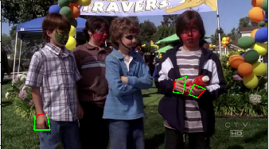
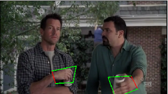 
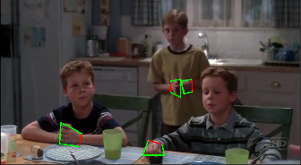 
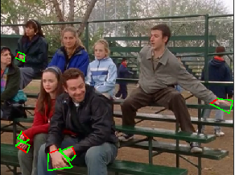
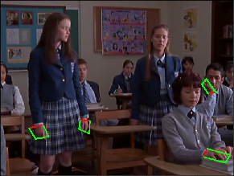 
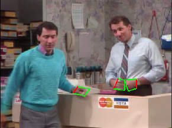 
</p>

#### Some images and annotations from the COCO-Hand data

<p float="left">
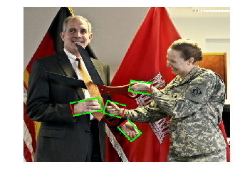
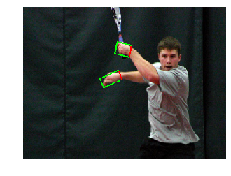 
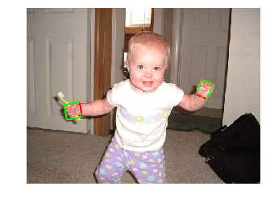 
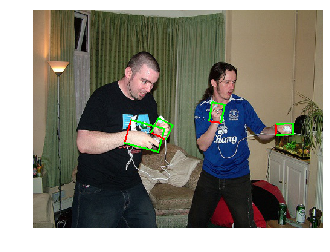
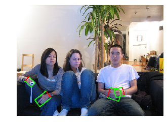 
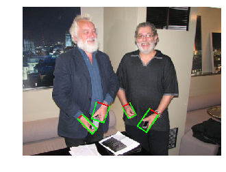 
</p>

### Citation

If you use the code or datasets in this repository, please cite the following paper:

```
@article{Hand-CNN,
  title={Contextual Attention for Hand Detection in the Wild},
  author={Supreeth Narasimhaswamy and Zhengwei Wei and Yang Wang and Justin Zhang and Minh Hoai},
  booktitle={International Conference on Computer Vision (ICCV)},
  year={2019},
  url={https://arxiv.org/pdf/1904.04882.pdf} 
}
```

